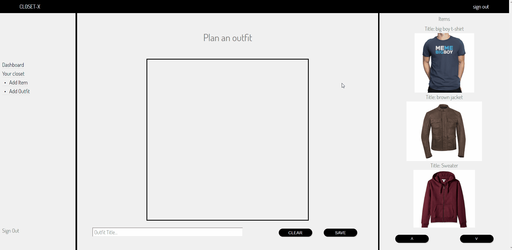

# CLOSET X

[Live Demo](http://Closet-x.herokuapp.com)

ClosetX is an online platform that allows you to digitize your closet! Design and plan outfits for upcoming events, coordinate with group members for a stylish evening out. Not only can you design your own outfits with items from your closet, you can help design outfits for others in their closet! The most important part of this is the user experience. Users will get other users to post their closets so that they can help plan their outfits! A platform connecting stylists and people that need to be styled.


## Technologies

ClosetX is built with the MERN stack: MongoDB, ExpressJS, ReactJS, and NodeJS.

## Features

### Drag and Drop with HTML Canvas



One of the main features of Closet-X allows users to combine their clothing items into unique outfits for future reference. 
The code snippet below is the render function contained in the ```OutfitCanvas``` component which allows the user to drag their items onto a HTML5 canvas element and arrange them however they please:

```javascript
//outfit_canvas.jsx

render() {
  const { connectDropTarget } = this.props;
  return connectDropTarget(
    <div className="canvas-container">
      <div className="canvas-header">Plan an outfit</div>
      <canvas
        id="canvas"
        onMouseDown={this.onMouseDown}
        onMouseUp={this.onMouseUp}
        onMouseMove={this.onMouseMove}
      >
      </canvas>
      <div className="outfit-create-options">
        <input type="text" value={this.state.title} onChange={this.handleChange}
          placeholder="Outfit Title..."></input>
        <div className="outfit-button-container">
          <button onClick={this.props.handleClear}>Clear</button>
          <button onClick={this.handleSave}>Save</button>
        </div>
      </div>
    </div>
  )
}
```
In the above snippet the canvas element has three event handlers attached to it. They control the dragging of items around the canvas. The ```onMouseDown``` event handler checks to see if any of items on the canvas are at the coordinates of the click. The ```onMouseMove``` controls the movement and the rerendering of the items that were included at the click coordinates. The ```onMouseUp``` releases the items that were included at the ```onMouseDown``` coordinates. The functions are as follows:

```javascript
//outfit_canvas.jsx

onMouseDown(e) {
  e.preventDefault();
  e.stopPropagation();

  let canvas = document.getElementById("canvas");

  let mx = parseInt(e.clientX - canvas.offsetLeft);
  let my = parseInt(e.clientY - canvas.offsetTop);

  this.setState({isDragging: false})
  for(let i = 0; i < this.props.items.length; i++) {
    let r = this.props.items[i];
    if(mx > r.x && mx < r.x + r.width && my>r.y && my<r.y+r.height) {
      r.isDragging=true;
      this.setState({isDragging: true});
    }
  }
  this.setState({startX: mx, startY: my})
}

onMouseUp(e) {
  e.preventDefault();
  e.stopPropagation();

  this.setState({isDragging: false});
  let curr;

  for(var i=0; i < this.props.items.length; i++){
    curr = this.props.items[i]
    curr.isDragging=false;
  }

  let canvas = document.getElementById("canvas");
  let ctx = canvas.getContext("2d");
  ctx.clearRect(0, 0, canvas.width, canvas.height);

  this.renderAll(ctx);
}

onMouseMove(e) {
  if(!this.state.isDragging) {return;}

  e.preventDefault();
  e.stopPropagation();
  let canvas = document.getElementById("canvas");

  let mx = parseInt(e.clientX - canvas.offsetLeft);
  let my = parseInt(e.clientY - canvas.offsetTop);

  let dx = mx - this.state.startX;
  let dy = my - this.state.startY;

  for(let i = 0; i < this.props.items.length; i++) {
    let r = this.props.items[i];
    if(r.isDragging) {
      r.x += dx;
      r.y += dy;
    }
  }
  this.setState({startX: mx, startY: my});

  let ctx = canvas.getContext("2d");
  this.renderAll(ctx);
}

```

### Drag and Drop of Images between components

Another challenge during this project involved dragging images between components while transfering all relevent information across components. To do this the React DnD module was implemented. Documentation can be found here: https://react-dnd.github.io/react-dnd/about.
  

The following code snippet contains the properties set for the ```OutfitCanvas``` componenet which is the drop target, i.e. where the dragged items will land:

```javascript
//outfit_canvas.jsx
const spec = {
  drop(props, monitor, component) {
    const item = monitor.getItem()
    props.onDrop(item)
  }
}

function collect(connect, monitor) {
  return {
    connectDropTarget: connect.dropTarget(),
    isOver: monitor.isOver(),
    isOverCurrent: monitor.isOver({ shallow: true }),
    canDrop: monitor.canDrop(),
    clientOffset: monitor.getClientOffset()
  };
}


export default DropTarget("image", spec, collect)(OutfitCanvas);
```
  
The following snippet shows how the ```OutfitCreate``` component is exported. It is wrapped in the ```DragDropContext``` wrapper to signify that it is the container for both the drag and drop components, i.e. it contains both the the source and the target of the drag items.
```javascript
//outfit_create.jsx
export default DragDropContext(HTML5Backend)(OutfitCreate);
```
  
The final snippet shows the monitored properties shared with the drop component. See that the exported component is wrapped in the ```DragSource``` wrapper in order to designate it as the source of the dragged items:
```javascript
//item_slide_show.jsx
const imageSource = {
  beginDrag(props, monitor, component) {
    const id = props.item._id;
    const initialPos = monitor.getClientOffset();
    const posDiff = monitor.getSourceClientOffset()
    const pos = {x: initialPos.x - posDiff.x, y: initialPos.y - posDiff.y}
    const source = props.item.imageURL;
    return {id, pos, source};
  }
}

function collect(connect, monitor) {
  return {
    connectDragSource: connect.dragSource(),
    posDiff: monitor.getDifferenceFromInitialOffset()
  };
}

export default DragSource("image", imageSource, collect)(ItemSliderShow);

```

